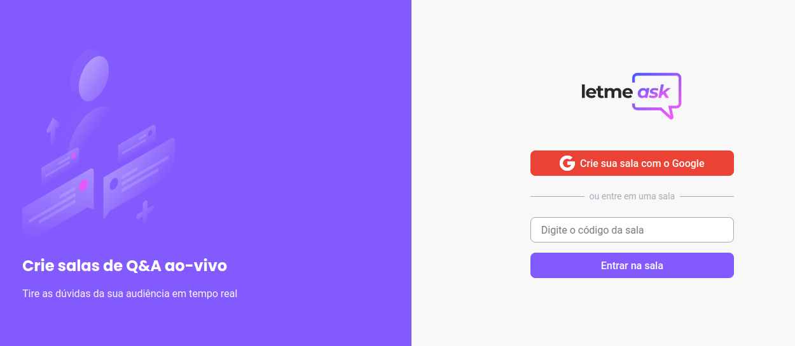
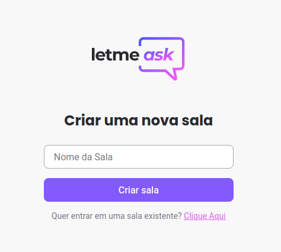
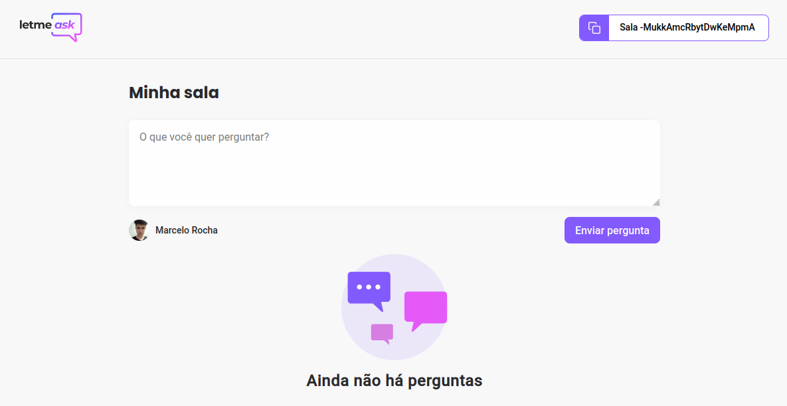
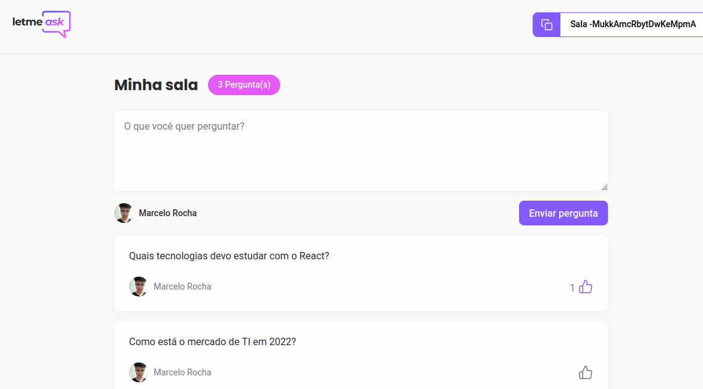
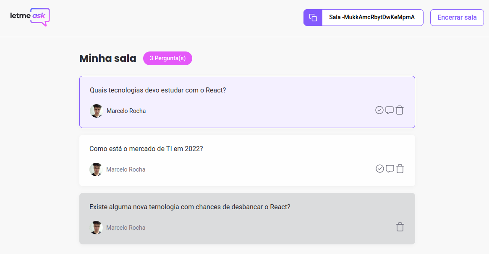

# Let Me Ask

<a href='https://let-me-ask-13098.web.app' target='_blank'>Acesse Aqui</a>

---

## Conhecimentos demonstrados:

- Javascript;
- SASS;
- HTML(JSX);
- ReactJS;
- React Routes;
- Autenticação com Google;
- Banco de dados em tempo real;

---

## A página:

Crie sua sala, receba perguntas em tempo real para responder em Live, as perguntas com mais pessoas interessadas estarão no topo da página.

É possível destacar a pergunta que está sendo respondida e marcá-la como respondida.

### Home:

    

É possível entrar em uma sala já criada sem fazer login, ou criar uma nova sala, para isso é necessária a autenticação com o Google.

### Criação de sala:

    

### Tela do usuário:

    

    

É possível marcar as perguntas mais interessantes com "gostei", para que as com mais votos estejam no topo e sejam respondidas com prioridade.

### Tela do Administrador:

    

É possível encerrar a sala, ver as dúvidas em tempo real e interagir com elas.
